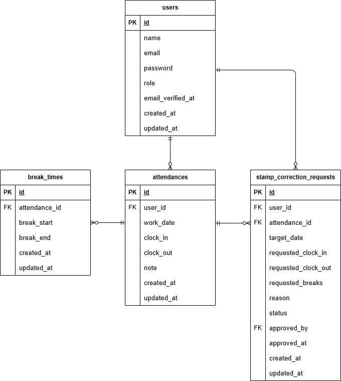

# アプリケーション名

coachtech 勤怠管理アプリ

## 使用技術（実行環境）

- PHP 8.x
- Laravel 8.x
- MySQL 8.x
- Nginx
- Docker / docker-compose

## 環境構築

### 0. リポジトリのクローン

```bash
git clone <リポジトリURL>
cd プロジェクト名
```

### 1. Docker コンテナのビルド・起動

```bash
docker compose up -d --build
```

### 2. PHP コンテナに入ってセットアップ

```bash
docker compose exec php bash

# 依存関係
composer install

# .env 作成 & APP_KEY 生成
cp .env.example .env
php artisan key:generate

```

※`.env.example` はセキュリティのためキーを空にしてあります。
自分の環境でキーを作って設定してください。

### 3. マイグレーション & シーディング実行

```bash
# php コンテナ内で実行
php artisan migrate --seed
```

## ダミーデータ（シーディング）について

- AttendanceSeeder は **先月／先々月の 1 ～ 10 日** にのみ勤怠・休憩データを作成します（タイムゾーン: Asia/Tokyo）。
- **当月には作成しません。**（採点日を汚さないため）
- 範囲を変更したい場合は `database/seeders/AttendanceSeeder.php` の
  `for ($m = 1; $m <= 2; $m++) { ... }` を調整してください。
- データをリセットしたい場合は `php artisan migrate:fresh --seed` を実行してください。

## ER 図



## URL

- 開発環境：http://localhost/
- 管理者ログイン: http://localhost/admin/login
- 一般ユーザーログイン: http://localhost/login
- MailHog UI: http://localhost:8025

## ログインアカウント

### 管理者

- **name**: Admin User
- **email**: admin@example.com
- **password**: password

### 一般ユーザー

- **name**: Test User
- **email**: user@example.com
- **password**: password

## メール送信の確認方法

本プロジェクトでは MailHog を使用しています。`docker compose up -d` で MailHog コンテナも起動します。  
ブラウザで http://localhost:8025 にアクセスするとメールを確認できます。
`.env.example` は MailHog 用に設定済みです。

```env
MAIL_CLIENT_URL=http://localhost:8025
```

## テストの実行方法

`php artisan test` は `.env.testing` を自動読込します。  
実行前に **テスト DB 作成 → migrate:fresh --seed（--env=testing）** を行ってください。

### 事前準備

#### .env.testing の作成

`.env.testing` はリポジトリに含めていません。`.env` と同階層に作成してください。

```bash
cp .env.testing.example .env.testing
```

#### APP_KEY の作成（値をコピーして .env.testing に貼り付け）

```bash
# PHPコンテナに入ってから
php artisan key:generate --show
```

#### テスト用 DB 作成（未作成の場合）

```bash
# ホスト側で実行
docker compose exec mysql mysql -u root -proot -e \
"CREATE DATABASE IF NOT EXISTS coachtech_attendance_test CHARACTER SET utf8mb4 COLLATE utf8mb4_unicode_ci;"
```

#### テスト環境用マイグレーション＆シーディング

```bash
# PHPコンテナに入ってから
php artisan migrate:fresh --seed --env=testing
```

#### テスト実行

```bash
# PHPコンテナに入ってから
php artisan test
# または
vendor/bin/phpunit
```
